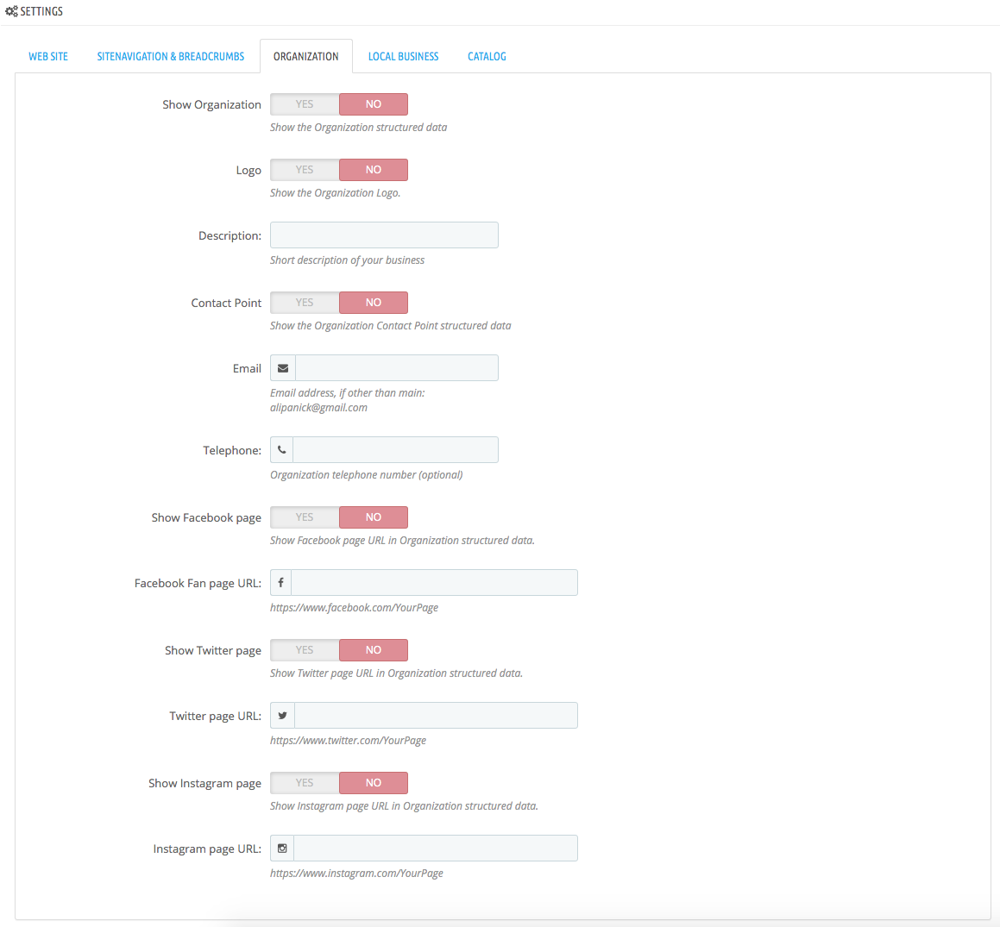

# InstantSEO

Prestashop module to easily add Structured Data compliant with Schema.org to your shop

It handles the following:

- WebSite
- WebPage
- SiteNavigationElement
- Breadcrumbs
- Organization (with Socials)
- LocalBusiness

## Prerequisites

- Prestashop versions: 1.7.6 - 1.7.7.6

## Screenshots

Below are the screenshots for the configuration settings:

### WebSite

### SiteNavigationElement & Breadcrumbs with selected CMS Pages to be included

### Organization

### Local Business

### License

[AFL-3.0](https://opensource.org/licenses/AFL-3.0)
